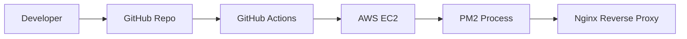
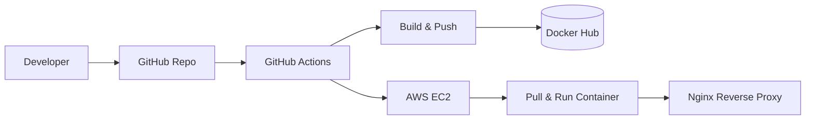

# AWS CI/CD Lab: Next.js Deployment Workflows

This repository demonstrates hands-on implementation of automated CI/CD pipelines using GitHub Actions to deploy a Next.js application to AWS EC2. It features two distinct deployment strategies: a direct PM2 deployment and a containerized Docker deployment.

## Overview

The primary purpose of this project is to showcase automated delivery workflows. It contains a fallback Next.js application (a simple portfolio starter) and the infrastructure-as-code necessary to deploy it. By comparing direct deployment against Docker deployment, the lab highlights different approaches to application hosting, state management, and containerization on AWS EC2.

## Key Features

- **Next.js Application**: Includes a functional React/Next.js application ready for deployment.
- **Dual CI/CD Pipelines**: Separate GitHub Actions workflows for direct deployment and Docker-based deployment.
- **Docker Integration**: Containerized application build and publish to Docker Hub.
- **Automated EC2 Provisioning**: Scripts to restart services and pull the latest application code/image on AWS.
- **Git SHA Tagging**: Traceable Docker image tags using the Git commit SHA.
- **Comprehensive Documentation**: Detailed markdown guides in the `docs/` folder for AWS setup and troubleshooting.

## Tech Stack

- **Cloud Infrastructure**: AWS EC2
- **CI/CD**: GitHub Actions
- **Containerization**: Docker, Docker Hub
- **Frontend Framework**: Next.js, React, Node.js
- **Process Management**: PM2
- **Web Server**: Nginx

## Architecture / Workflow

### Direct Deployment (PM2)


### Docker Deployment


## Project Structure

```text
plane-aws-cicd-lab/
├── .github/
│   └── workflows/          # GitHub Actions CI/CD pipelines
├── docs/                   # Detailed documentation for AWS & Deployment
├── fallback-app/           # Next.js application source code
│   ├── pages/              # Next.js routes
│   ├── public/             # Static assets
│   ├── Dockerfile          # Docker configuration for Next.js app
│   └── package.json        # Dependencies and scripts
└── README.md               # Main project documentation
```

## Prerequisites

- Node.js (v18+)
- Docker
- AWS Account (Free Tier eligible)
- GitHub Account with Docker Hub credentials

## Installation

1. **Clone the repository:**
   ```bash
   git clone https://github.com/Abdullah-Zuberi/plane-aws-cicd-lab.git
   cd plane-aws-cicd-lab
   ```

2. **Install application dependencies:**
   ```bash
   cd fallback-app
   npm install
   ```

## Running the Project

To run the Next.js application locally:

```bash
cd fallback-app
npm run dev
```
The application will be available at `http://localhost:3000`.

## Docker

To build and run the Docker container locally:

1. **Build the image:**
   ```bash
   cd fallback-app
   docker build -t nextjs-app .
   ```

2. **Run the container:**
   ```bash
   docker run -p 3000:3000 nextjs-app
   ```

## CI/CD

The repository contains two workflows triggered manually (`workflow_dispatch`):
- `direct-deploy.yml`: Connects to EC2 via SSH, pulls the latest code, installs dependencies, and restarts PM2.
- `docker-deploy.yml`: Builds the Docker image, pushes it to Docker Hub, connects to EC2, stops the old container, pulls the new image, and runs it.

## Configuration

The CI/CD pipelines rely on the following GitHub Secrets:

- `EC2_HOST`=<your-ec2-public-ip>
- `EC2_USER`=<your-ec2-username>
- `EC2_SSH_PRIVATE_KEY`=<your-private-key>
- `DOCKERHUB_USERNAME`=<your-dockerhub-username>
- `DOCKERHUB_TOKEN`=<your-dockerhub-token>

*Do not commit actual keys or tokens to the repository.*

## License

This project is licensed under the MIT License (as specified in `package.json`).
